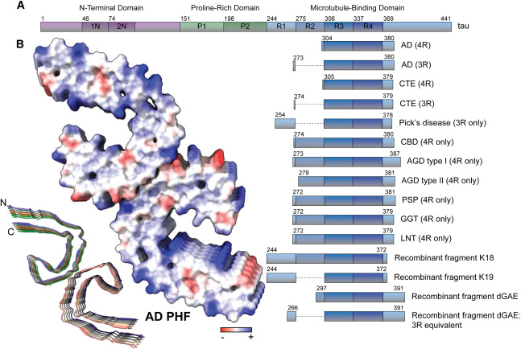

# Background

Traumatic brain injury (TBI) is traditionally viewed as a focal insult, in which neurons at the site of impact undergo acute necrotic or apoptotic cell death. However, it is now well established that the consequences of brain injury extend beyond the cortical neurons directly affected by the initial trauma. Injury to the cortex induces significant changes in the local extracellular environment, including inflammation and increased levels of proneurotrophins such as proNGF and proBDNF. These injury-induced alterations in neurotrophin signaling can propagate retrogradely to afferent neuronal populations that project to the injured region, leading to delayed and secondary degeneration that unfolds over days to weeks after the initial injury [@montroullProneurotrophinsInduceApoptotic2020]. 

Basal forebrain cholinergic neurons (BFCNs), which send extensive axonal projections to the cerebral cortex, undergo retrograde degeneration following cortical TBI despite the absence of direct mechanical damage to their cell bodies. Importantly, this degeneration is mediated by signaling events initiated at the distal axon terminals within the injured cortex, rather than by intrinsic somatic damage. The signal that mediates this is an increase in the amount of the immature proform of nerve growth factor (proNGF) in the cerebral cortex, this results in retrograde degeneration of BFCNs through activation of proNGF receptor p75NTR. In addition, previous work from the lab showed that local axonal protein synthesis and retrograde transport mediated proNGF-induced degeneration which was initiated at the axon terminal [@dasguptaProNGFElicitsRetrograde2024].

Proteomic analysis performed in our laboratory following proNGF exposure in BFCN axons identified several proteins whose levels increased during the early stages of degeneration. Among the proteins showing statistically significant increases were the amyloid precursor protein (APP) and Tau (microtubule-associated protein Tau, MAPT). Previous work from the laboratory focused on understanding the mechanisms underlying the upregulation of APP. My present study investigates the regulation of Tau and its relationship to APP upregulation, specifically examining whether proNGF–p75NTR signaling promotes increased Tau synthesis in axons during the early stages of retrograde degeneration and exploring the potential role of newly synthesized Tau in this process.

Tau has classically been studied in the context of neurodegenerative diseases such as Alzheimer's disease [@Lei2016], but accumulating evidence indicates that Tau also plays important roles in axonal signaling, transport regulation, and neuronal responses to injury. Based on these observations, Tau may act downstream of p75NTR signaling at axon terminals and contribute to the axonal fragmentation observed in basal forebrain cholinergic neurons.

## Neurotrophins and p75NTR in Injury

Traumatic brain injury causes immediate mechanical damage at the site of impact but also triggers secondary molecular changes that spread through connected neural circuits. Neurons projecting to the injured cortex therefore experience disrupted target-derived signaling at their distal axons despite the physical separation of their somata from the injury site. These changes can initiate regulated retrograde degeneration involving receptor-mediated signaling at axon terminals and the retrograde transport of injury signals [@dasguptaProNGFElicitsRetrograde2024].

Neurotrophins are key regulators of neuronal survival and maintenance, and their signaling balance is profoundly disrupted after brain injury [@Dechant2002; @Kaplan2013]. All neurotrophins are synthesized as precursor proneurotrophins that are normally cleaved to generate mature trophic factors. After TBI, however, the balance shifts toward increased levels of proneurotrophins such as proNGF and proBDNF relative to their mature counterparts [@Counts2011].

Proneurotrophins bind with high affinity to p75NTR, particularly in complexes containing sortilin, and preferentially activate degenerative signaling pathways [@tengProBDNFInducesNeuronal2005; @volosinInteractionSurvivalDeath2006]. Consistent with this mechanism, p75NTR signaling contributes to secondary degeneration following cortical injury, and genetic or pharmacological disruption of p75NTR signaling protects neurons projecting to the injured cortex [@dasguptaProNGFElicitsRetrograde2024].

## Basal Forebrain Cholinergic Neurons

Basal forebrain cholinergic neurons provide widespread cholinergic innervation to the cortex and hippocampus and are essential for cognitive functions such as attention, learning, and memory. A defining feature of BFCNs is their continued expression of p75NTR throughout adulthood, distinguishing them from many other central neurons [@Yaar1997].

Following cortical injury, BFCNs exhibit axonal degeneration and loss that is ipsilateral to the site of injury, despite the absence of direct trauma to the basal forebrain [@Counts2011; @dasguptaProNGFElicitsRetrograde2024]. In vitro compartmentalized culture systems have demonstrated that activation of p75NTR specifically at BFCN axon terminals is sufficient to induce axonal fragmentation and retrograde cell death [@dasguptaProNGFElicitsRetrograde2024]. Notably, axonal degeneration often precedes somatic apoptosis, indicating that axons are an early and primary target of injury-induced signaling.

These properties make BFCNs an ideal model system for dissecting the molecular mechanisms of retrograde degeneration initiated by cortical injury.

## Tau background and roles

Tau is a microtubule-associated protein that is highly enriched in axons, where it binds microtubules and contributes to the organization of the axonal cytoskeleton. Early studies demonstrated that tau becomes selectively enriched in the distal axon during neuronal polarization, supporting a role in establishing neuronal polarity and axonal identity [@kempfTauBindsDistal1996]. 

More recent work indicates that tau does not simply act as a constitutive stabilizer of microtubules but instead helps regulate microtubule organization and dynamics within axons. In particular, tau promotes the formation of long labile microtubule domains that support cytoskeletal remodeling and axonal transport processes [@qiangTauDoesNot2018]. 

In addition to regulating microtubules directly, tau can coordinate interactions between microtubules and the actin cytoskeleton, thereby contributing to axonal structure, growth cone dynamics, and neurite extension [@elieTauCoorganizesDynamic2015; @biswasMicrotubuleAssociatedProteinTau2018]. Through these functions, tau plays an important role in maintaining neuronal architecture and supporting intracellular trafficking along axons.

Tau also participates in the regulation of intracellular transport by modulating the interaction between motor proteins and the microtubule lattice. Experimental studies demonstrated that tau molecules bound along microtubules can alter motor access to the microtubule surface and influence the motility of kinesin- and dynein-driven cargoes [@dixitDifferentialRegulation2008; @chaudharyTauDirects2018]. More recent work further showed that tau can differentially regulate the trafficking of specific cargo populations, including endosomes and lysosomes, indicating that tau can selectively tune intracellular transport depending on cargo type and motor engagement [@balabanianTauDifferentiallyRegulates2022].

Under pathological conditions, tau undergoes abnormal post-translational modifications, most prominently hyperphosphorylation, which reduces its affinity for microtubules and disrupts cytoskeletal organization and axonal transport. Detachment of tau from microtubules can promote its mislocalization and aggregation into soluble oligomers and eventually into paired helical filaments and neurofibrillary tangles, a defining pathological feature of Alzheimer’s disease and other tauopathies [@wangTauPosttranslationalModifications2016]. Importantly, such alterations in tau function are associated with early defects in axonal transport and synaptic function, highlighting the importance of tau-mediated transport regulation in neuronal health and degeneration.

### Tau gene structure and isoforms

The human *MAPT* gene, located on chromosome 17q21, contains 16 exons and gives rise to six tau isoforms in the adult central nervous system through alternative splicing of exons 2, 3, and 10 [@goedertMultipleIsoformsHuman1989; @andreadisTauGeneAlternative2005]. Alternative splicing of exons 2 and 3 generates variants with zero, one, or two N-terminal inserts (0N, 1N, or 2N), while inclusion or exclusion of exon 10 produces isoforms with either four or three microtubule-binding repeats (4R or 3R). The resulting six isoforms (0N3R, 1N3R, 2N3R, 0N4R, 1N4R, and 2N4R) range from 352 to 441 amino acids in length (@fig-tau-isoforms). Notably, the ratio of 3R to 4R tau is developmentally regulated: fetal brain expresses predominantly the shortest 0N3R isoform, whereas adult brain contains roughly equal proportions of 3R and 4R isoforms [@goedertExpressionSeparateIsoforms1990]. The 4R isoforms exhibit higher microtubule-binding affinity than 3R isoforms due to the presence of the additional repeat encoded by exon 10 [@goedertMultipleIsoformsHuman1989].

{#fig-tau-isoforms}

Structurally, tau protein is organized into four major functional domains (@fig-tau-structure). The **N-terminal projection domain** (encoded by exons 1–5) extends away from the microtubule surface and mediates interactions with the plasma membrane, signaling molecules, and motor protein complexes such as dynactin [@magnaniInteractionTauProtein2007]. The **proline-rich region** (encoded by exons 7 and 9) contains numerous phosphorylation sites and serves as a docking site for SH3 domain-containing proteins and kinases. SH3 (Src Homology 3) domains are small protein modules that recognize proline-rich motifs and mediate protein–protein interactions in signaling cascades; SH3-containing proteins that interact with tau include the Src family kinases (such as Fyn), phospholipase C-γ, and the p85 regulatory subunit of PI3K, linking tau to pathways that regulate cytoskeletal dynamics, synaptic signaling, and cell survival. The **microtubule-binding repeat domain (MTBD)** consists of three or four imperfect repeats of 31–32 amino acids each (encoded by exons 9–12) that directly bind and stabilize microtubules. Finally, a short **C-terminal tail** follows the MTBD. Many disease-associated phosphorylation sites, including pThr181 and the AT8 epitope (pSer202/pThr205), are located in the proline-rich region flanking the MTBD, while sites such as pSer396 and pSer404 lie in the C-terminal region [@bueeTauProteinIsoforms2000; @wangTauPhysiologyPathology2016].

{#fig-tau-structure}

### Rodent tau isoforms and developmental regulation

While humans express all six tau isoforms in adult brain with roughly equal 3R:4R ratios, rodent tau expression differs substantially [@mcmillanTauIsoformRegulation2008]. Adult mouse and rat brain predominantly express 4R tau isoforms, with 3R isoforms largely restricted to the fetal and early postnatal period [@tuerdeIsoformindependentDependentPhosphorylation2018]. In mice, up to four tau isoforms are detected (0N3R, 0N4R, 1N4R, 2N4R), with 0N4R being the predominant adult isoform [@liuProfilingMurineTau2013]. The developmental switch from 3R to 4R expression occurs during the first two postnatal weeks: at postnatal day 5–6 (P5–P6), 3R tau predominates; by P14–P15, both 3R and 4R are expressed at similar levels; and by P21 and into adulthood, 4R isoforms become dominant [@tuerdeIsoformindependentDependentPhosphorylation2018; @buchholzSixBrainspecificTAU2024].

This developmental pattern has important implications for studies using cultured rodent neurons. Embryonic and early postnatal rat neurons, such as those used in our basal forebrain cholinergic neuron cultures, predominantly express the 0N3R and 0N4R isoforms—the shortest tau variants lacking the N-terminal inserts encoded by exons 2 and 3 [@liuProfilingMurineTau2013].

The predominance of 0N3R in fetal brain and its gradual replacement by 4R isoforms during postnatal development reflects the maturation-dependent regulation of *MAPT* exon 10 splicing [@bullmannPatternTauIsoforms2009]. Understanding this developmental regulation is essential for interpreting tau biochemistry in neuronal culture systems, where the isoform composition depends on the developmental stage at which neurons are harvested.

### Core roles of Tau

- **Organization of axonal microtubules and neuronal polarity**
  - Tau is enriched in the distal axon early during neuronal polarization, where its localization depends on intact microtubules and microfilaments, supporting a role in axonal identity and neuronal polarity [@kempfTauBindsDistal1996].
  - In axons, tau helps organize microtubule architecture and promotes the formation of long labile microtubule domains, rather than functioning only as a general microtubule stabilizer [@qiangTauDoesNot2018].

- **Coordination of microtubule–actin interactions**
  - Tau can bind microtubules and actin simultaneously and promote co-organization and coupled growth of both cytoskeletal networks in vitro [@elieTauCoorganizesDynamic2015].
  - In living neuronal growth cones, tau supports microtubule bundling and enables dynamic microtubules to extend into actin-rich lamellipodia and filopodia, thereby contributing to axon outgrowth and guidance [@biswasMicrotubuleAssociatedProteinTau2018].
  
- **Regulation of axonal transport**
  - Supports efficient bidirectional trafficking by tuning the accessibility of microtubule tracks for kinesin/dynein-driven cargo movement. [@dixitDifferentialRegulationDynein2008; @magnaniInteractionTauProtein2007; @balabanianTauDifferentiallyRegulates2022; @chaudharyTauDirectsIntracellular2018]
  
  - Under pathological conditions, hyperphosphorylated tau can trap/perturb the motor-adaptor complexes c-Jun N-terminal kinase- interacting protein 1 (JIP1)–kinesin , disrupting cargo-selective transport.
    [@ittnerPhosphorylatedTauInteracts2009]

- **Signaling scaffold (stress and kinase signaling integration)** 
  - Tau can function as a signaling scaffold that organizes kinase signaling pathways in neurons. Tau contains proline-rich motifs that bind the SH3 domain of Src-family kinases such as Fyn, allowing tau to recruit Fyn to neuronal signaling complexes and couple extracellular receptor activation to intracellular kinase signaling [@leeTauInteractsSrcfamily1998; @ittnerDendriticFunctionTau2010].  
  - Tau also participates in stress-activated kinase signaling networks involving JNK. Pathological tau has been shown to interact with the JNK scaffold protein JIP1, disrupting its normal interaction with kinesin light chain and altering JNK signaling and axonal transport pathways [@ittnerPhosphorylatedTauInteracts2009].

- **Synaptic function and plasticity**
  - Tau contributes to synaptic plasticity by regulating postsynaptic receptor trafficking, synaptic signaling complexes, and dendritic spine dynamics. Loss of tau disrupts activity-dependent trafficking of AMPA receptors and alters NMDA-dependent synaptic responses, demonstrating that tau participates in the dynamic regulation of postsynaptic signaling and synaptic efficacy [@suzukiMicrotubuleAssociatedTau2017; @ittnerDendriticFunctionTau2010; @sydowTauInducedDefects2011].

- **Nuclear and stress-related roles**
  - A fraction of tau localizes to the neuronal nucleus, where it can bind DNA and protect genomic integrity under stress conditions. Nuclear tau has been shown to accumulate after heat or oxidative stress and to protect neuronal DNA from stress-induced damage [@sultanNuclearTauKey2011].
    
### Tau mechanisms of regulation of intracellular trafficking along the microtubules

Tau can regulate intracellular trafficking by modulating the interaction between motor proteins and microtubules. When bound along microtubules, tau molecules can influence the accessibility of motor-binding sites and thereby alter the movement of kinesin- and dynein-driven cargo (@fig-tau-motors). Single-molecule and in vitro transport assays demonstrated that tau acts as an obstacle on the microtubule surface that preferentially interferes with kinesin processivity while allowing dynein motors to bypass or reverse direction, thereby altering the balance of bidirectional transport along axons [@dixitDifferentialRegulation2008; @chaudharyTauDirectsIntracellular2018].

{#fig-tau-motors}

In addition to altering motor motility directly on the microtubule lattice, tau can also regulate trafficking through interactions with motor adaptor complexes. Tau has been shown to interact with components of the dynein–dynactin transport machinery, suggesting that it can influence the recruitment or stabilization of retrograde transport complexes on axonal microtubules [@magnaniInteractionTauProtein2007]. 

More recent studies using live-cell imaging of vesicle trafficking demonstrated that tau can regulate the transport of specific cargo populations rather than globally affecting all vesicular transport. In particular, tau was shown to differentially regulate the motility of endosomes and lysosomes, indicating that tau can selectively modulate intracellular trafficking depending on cargo type and motor engagement [@balabanianTauDifferentiallyRegulates2022].

Together, these findings indicate that tau functions as a regulator of motor access and coordination on microtubules rather than simply acting as a structural stabilizer of the cytoskeleton. Through these mechanisms, changes in tau abundance, isoform composition, or post-translational modification can alter intracellular trafficking and thereby influence neuronal signaling and degeneration.

#### Tau interaction with the dynein–dynactin transport machinery

Tau regulates axonal transport by interacting directly with components of the dynein–dynactin motor complex. Specifically, Tau acts as a molecular scaffold: its C-terminal repeat domain anchors to microtubules, while its N-terminal projection domain (encoded by exons 1–4) binds to the p150 subunit of dynactin, a key activator of retrograde transport.  This structural arrangement stabilizes the transport machinery on axonal microtubules, promoting efficient retrograde cargo movement. [@magnaniInteractionTauProtein2007]. 
Consistent with this model, the authors showed that the presence of tau increases the association of the dynactin complex with microtubules in vitro, suggesting that tau helps stabilize transport complexes on the microtubules. Importantly, this interaction occurs through sequences encoded by exons 1–4 of the tau protein, indicating that the N-terminal projection domain mediates the dynactin interaction while the microtubule-binding repeats anchor tau to the microtubule cytoskeleton. The neuronal model used in this study expressed only the 0N3R and 0N4R tau isoforms which lack exons 2 and 3. As reported by the authors: _“SH-SY5Y cells express only the shortest three- and four-repeat tau isoforms without amino-terminal inserts.”_ Despite this, dynactin p150 was still found to co-immunoprecipitate with tau, showing that the absence of N-terminal inserts does not impair the ability of tau to bind dynactin. This observation is particularly relevant to our experimental neuronal culture systems that showed similar tau isoforms present. This dual role of tau in microtubule stabilization and transport regulation is particularly relevant in the context of axonal injury and degeneration, where disruptions in either function can either prevent or contribute to axon degeneration and cell death. Our labs previous study showed that blocking dynein-dependent retrograde transport with the inhibitor "ciliobrevin D" prevented both axon degeneration and neuronal death induced by axonal proNGF stimulation [@dasguptaProNGFElicitsRetrograde2024]. These results indicate that degenerative signals initiated at the axon terminal must be transported retrogradely to the soma to execute the degeneration program. Together with study showing that tau interacts with the dynactin–dynein motor complex, it is possible that tau contributes to the regulation of retrograde signaling by facilitating the association of the dynein–dynactin transport machinery with microtubules. Thus, the local translation upregulation of tau functions to stabilize the efficiency of retrograde transport to allow axonal degeneration. 

#### Tau interaction with kinesin-dependent transport

Tau has also been shown to regulate anterograde axonal transport by modulating the interaction between kinesin motor proteins and microtubules. A recent study investigated how tau influences kinesin- and dynein-driven vesicle trafficking by examining motor movement along microtubules in the presence of tau [@balabanianTauDifferentiallyRegulates2022].

The authors demonstrated that tau bound along microtubules can influence the ability of kinesin motors to engage the microtubule surface and move cargo efficiently. In vitro reconstitution assays and live-cell imaging showed that increasing tau density on microtubules can reduce kinesin-driven transport by limiting motor access to the microtubule lattice. This effect is thought to occur because tau molecules occupy binding sites along the microtubule surface, thereby creating physical obstacles that alter kinesin processivity and cargo motility.

Importantly, the study showed that different tau isoforms can differentially regulate motor transport. In particular, the short 3R tau isoform displayed distinct effects on motor-driven cargo trafficking compared with 4R isoforms, suggesting that tau splice variants can modulate axonal transport in an isoform-dependent manner [@balabanianTauDifferentiallyRegulates2022]. This observation is particularly relevant because neuronal systems often express specific tau isoform compositions that may influence transport behavior.

Together, these findings indicate that tau can act as a regulator of motor access to microtubule tracks, thereby tuning the balance between anterograde kinesin-driven transport and retrograde dynein-driven transport. In the context of axonal signaling and degeneration, this regulatory role suggests that changes in tau abundance or local synthesis could alter the efficiency of cargo transport along axons, potentially influencing the propagation of injury signals.

### Retrograde Degenrative Signaling of p75NTR

A recent study investigating retrograde degenerative signaling demonstrated that activation of p75NTR at distal axons can generate a pro-apoptotic signal that is transported retrogradely to the neuronal soma. Using sympathetic neurons cultured in microfluidic chambers, Pathak et al. showed that activation of p75NTR in distal axons—either by ligand binding or trophic factor deprivation—induces local proteolytic cleavage of the receptor and release of its intracellular domain (p75ICD). This intracellular fragment functions as a retrograde degenerative signal that is transported along microtubules to the soma through the dynein–dynactin motor complex, ultimately triggering neuronal apoptosis. The study further demonstrated that this transport requires HDAC1-dependent deacetylation of the dynactin subunit p150Glued, which enhances its interaction with dynein and promotes retrograde trafficking of the p75ICD-containing signaling complex. 

retrograde_axonal_hdac_mmc2

Although this work provides important mechanistic insight into p75NTR-dependent retrograde degeneration, the experimental system differs from the model used in the present study. Pathak et al. examined sympathetic neurons from the peripheral nervous system, where apoptosis is induced by trophic factor deprivation or by activation of p75NTR with ligands such as BDNF applied to distal axons. In contrast, the current study focuses on basal forebrain cholinergic neurons (BFCNs), a central nervous system population that degenerates in neurodegenerative diseases such as Alzheimer’s disease. Rather than trophic deprivation alone, degeneration in our system is triggered by proNGF signaling through p75NTR, which is known to be elevated in neurodegenerative conditions. Thus, while both models involve p75NTR-dependent retrograde signaling, they differ in neuronal subtype, upstream stimulus, and disease relevance, suggesting that distinct but potentially related mechanisms may regulate degenerative signaling in these neurons.

### Post-translational modifications and why phosphorylation matters

Tau's functional "mode" is strongly shaped by post-translational modifications (PTMs), including phosphorylation, acetylation, truncation, ubiquitination, glycation, and others. These PTMs can change tau's microtubule affinity, subcellular localization, interactions with motors/adaptors, and aggregation propensity.
(Review: https://www.mdpi.com/1422-0067/22/17/9207)

Phosphorylation is especially important because it can directly weaken tau–microtubule binding and shift tau toward conformations and interaction networks that impair trafficking and favor aggregation. Site-specific phosphorylation patterns are also leveraged as biomarkers (CSF/plasma) and neuropathology readouts.
(Review overview of phosphorylation patterns/biomarkers: https://pmc.ncbi.nlm.nih.gov/articles/PMC10839341/)

### Antibodies used in this study (tau phosphorylation readouts)

In this research, I quantified tau phosphorylation using three antibodies that report distinct tau states:

- **pThr181 (p-tau181)**: commonly used biomarker-associated phosphorylation site that tracks Alzheimer's disease-related tau pathology in CSF and plasma and is widely used for staging/stratification.
  (Context review: https://pmc.ncbi.nlm.nih.gov/articles/PMC10839341/)

- **AT8 (pSer202/pThr205)**: canonical neuropathology epitope used to detect early and established pathological tau (pre-tangles/tangles) in tissue; often treated as a marker of disease-associated tau phosphorylation.
  (Epitope/usage context: https://www.alzforum.org/alzantibodies/tau-at8-phospho-tau-ser-202-thr-205)

- **pSer622**: a C-terminal tau site sometimes assessed in biochemical studies; interpretation can depend on antibody specificity and isoform context, and is typically considered alongside broader phosphorylation patterns rather than as a standalone "core biomarker" site.
  (Phosphorylation landscape context: https://pmc.ncbi.nlm.nih.gov/articles/PMC10839341/)

## proNGF–p75NTR signaling and tau phosphorylation

A central focus of this thesis is how **proNGF–p75NTR signaling** engages stress-associated kinase cascades that converge on tau phosphorylation states linked to axonal dysfunction and degeneration.

Genetic deletion of p75NTR attenuates tau hyperphosphorylation in a tauopathy mouse model, and p75NTR is required for ligand-driven tau phosphorylation in vitro, supporting a causal role for p75NTR signaling in tau phosphorylation pathways. [@manucat-tanKnockoutP75Neurotrophin2019]

Mechanistically, p75NTR activation can engage downstream kinases including **JNK**, a stress-activated MAPK family member with well-described roles in neurodegenerative signaling. JNK isoforms can phosphorylate tau at multiple sites and influence tau's interaction landscape, consistent with a model where p75NTR-dependent stress signaling drives tau modifications that destabilize the axonal cytoskeleton and transport. [@solasJNKActivationAlzheimers2023]

As mentioned above, Tau is also positioned to integrate signaling and transport because under pathological conditions hyperphosphorylated tau interacts with the JNK scaffold/adaptor **JIP1**, which associates with kinesin motor complexes; this interaction disrupts kinesin motor complex formation and is linked to axonal transport defects. [@ittnerPhosphorylatedTauInteracts2009]

### Linking p75NTR Signaling, Tau, and Axonal Fragmentation After TBI

Recent work from our laboratory has demonstrated that proneurotrophin stimulation of BFCN axons induces local axonal protein synthesis, retrograde transport of degenerative signals, and axonal fragmentation through p75NTR-dependent mechanisms [@dasguptaProNGFElicitsRetrograde2024; @cagnettaRapidCueSpecificRemodeling2018]. These findings identify axons as active sites of signal integration rather than passive conduits.

Within this framework, Tau is well positioned to act as a downstream effector of p75NTR signaling. By modulating microtubule stability, axonal transport, and cytoskeletal organization, Tau may translate p75NTR–JNK signaling into the structural breakdown of axons observed after cortical injury. This raises the possibility that Tau is not merely a marker of degeneration but an active participant in injury-induced axonal fragmentation.

## Scope and Aims of Thesis
The overarching goal of this thesis is to define the role of Tau in p75NTR-mediated degeneration and the axonal fragmentation of basal forebrain cholinergic neurons following cortical injury. 

Specifically, this work aims to:
- Characterize p75NTR-dependent signaling in BFCNs following axonal proNGF treatment to determine whether the increase in Tau synthesis occurs upstream or downstream of APP. Additionally, this aim explores whether newly synthesized Tau is required for p75NTR-induced axonal degeneration and fragmentation.
- Evaluate the dependency of Tau on APP by determining if blocking the synthesis of new APP prevents the subsequent increase in Tau and protects against axonal degeneration.
- Quantify the levels of total and phosphorylated Tau after proNGF treatment to identify whether proNGF increases specific phospho-Tau species that are associated with axonal degeneration
