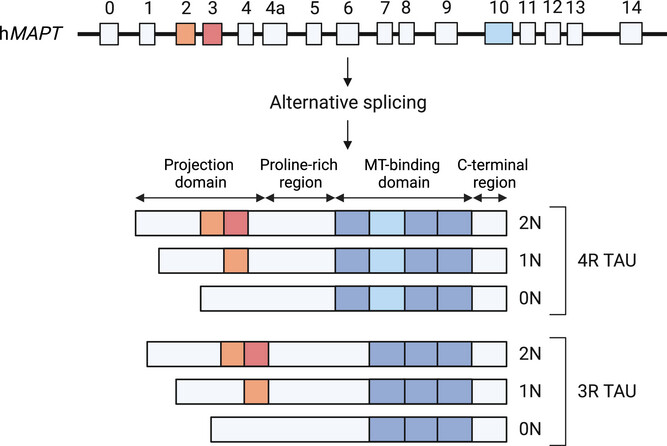
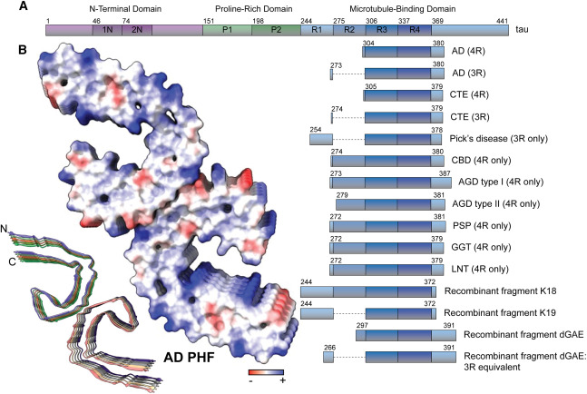

```{r}
#| label: setup
#| include: false
library(tidyverse)
library(ggplot2)

COL_BLUE <- "#4472C4"
COL_GREY <- "#A6A6A6"
PAL_COMP <- c(Soma = "#4A90D9", Axon = "#E07B54")
PAL_COND <- c(Control = "#A6A6A6", proNGF = "#4472C4")

theme_wb <- function() {
  theme_classic(base_size = 13) +
    theme(
      axis.text.x        = element_text(size = 11),
      plot.title         = element_text(face = "bold", size = 13),
      plot.subtitle      = element_text(size = 10, color = "grey45"),
      panel.grid.major.y = element_line(color = "grey90"),
      legend.position    = "right"
    )
}

# ── ddPCR copy-number concentrations (copies/µL) ──────────────────────────────
ddpcr <- tibble::tribble(
  ~Compartment, ~Condition, ~Tau,    ~Actin,
  "Soma",       "Control",  202.70,  481.51,
  "Soma",       "proNGF",   308.78,  1019.05,
  "Axon",       "Control",  16.91,   52.43,
  "Axon",       "proNGF",   171.43,  944.33
) |>
  mutate(
    Compartment = factor(Compartment, levels = c("Soma", "Axon")),
    Condition   = factor(Condition,   levels = c("Control", "proNGF")),
    Tau_Actin   = Tau / Actin
  )
```

# Background

## Rationale

The nascent axonal proteome identified **two tau isoforms in the soma** —
**0N3R and 0N4R** — but only a **single isoform, 0N3R**, was detected as newly
synthesized in the axon.

This selectivity could arise at **two levels**:

- **mRNA localization** — 0N3R mRNA is preferentially trafficked to axons, or
- **Local translation** — 0N3R is selectively translated in the axon even when
  0N4R mRNA is present

**Goal:** Use **digital droplet PCR (ddPCR)** to quantify total tau mRNA in the
**axon** and **soma** compartments separately, and to ask whether **proNGF**
treatment affects mRNA abundance in each compartment.

---

## Tau Isoforms

**Six CNS isoforms** arise from alternative splicing of **exons 2, 3, and 10**
of the *MAPT* gene, generating **0N/1N/2N** (N-terminal inserts) and **3R/4R**
(microtubule-binding repeats) variants. **Exon 10 inclusion → 4R**, which binds
microtubules more tightly than 3R.

The proteomic data implicate **0N3R** and **0N4R** specifically — these differ
only by **exon 10**, the determinant of the **3R vs 4R** repeat domain.

---

## Tau Isoforms — Splicing & Structure

:::: {.columns}
::: {.column width="50%"}
{width=100%}
:::
::: {.column width="50%"}
{width=100%}
:::
::::

---

## Approach

- Primers landed in the **5′ UTR** of the rat *Mapt* transcript — a region
  **shared by all isoforms**, so this assay reads out **total tau mRNA**
  (see primer-design slide)
- Validated first by conventional **RT-PCR** on soma and axon lysates
- **ddPCR** on the **Bio-Rad QX200** system with **EvaGreen** Supermix
- **Beta-actin** co-loaded on the same plate as a reference gene
- Filter chamber cultures · **Control vs proNGF** · **Soma vs Axon**

# Results

## Primer Design — PrimerQuest

Primers were designed with **IDT PrimerQuest**, targeting the rat *Mapt*
(NM_017212) transcript.

{width=70% fig-align="center"}

**Caveat:** the selected primer pair fell in the **5′ UTR** — taken **by
mistake** rather than from the coding region. Because the 5′ UTR is **shared by
0N3R and 0N4R**, the assay measures **total tau mRNA only** and **cannot
distinguish the isoforms**. This is why isoform-specific primers are an
explicit next step.

---

## Primer Validation

Conventional RT-PCR on soma and axon lysates from filter chamber cultures
produced a **band of the expected size in both compartments**.

- Confirms the 5′ UTR primers amplify reliably in this material
- Confirms **tau mRNA is present in the axon fraction** — consistent with the
  proteomic evidence that tau is locally synthesized there

---

## ddPCR — Raw Copy Numbers

```{r}
#| label: ddpcr-table
knitr::kable(
  ddpcr |>
    transmute(Compartment, Condition,
              `Tau (copies/µL)`   = sprintf("%.2f", Tau),
              `Actin (copies/µL)` = formatC(Actin, format = "f", big.mark = ",", digits = 2))
)
```

---

## ddPCR — Key Observations

- **Axon tau** rises **~10-fold** with proNGF (16.91 → 171.43)
- **Soma tau** rises **~1.5-fold** with proNGF (202.70 → 308.78)
- Under control conditions the **soma has ~12× more tau** than the axon
  (202.70 vs 16.91)

---

## Is the Increase Just Loading?

Raw increases (proNGF ÷ Ctrl) — **Soma:** tau 1.5×, actin 2.1× · **Axon:** tau 10×, actin 18×

- ddPCR counts **absolute copies**, so over-loading a well inflates *every*
  transcript by the same factor — tau and actin rise **together**, and the
  **tau/actin ratio is loading-independent**.
- **Soma:** the ratio actually *falls* (0.42 → 0.30); dividing tau by the 2.1×
  actin rise drops it below control (~147 vs 202.70), so the soma increase
  **cannot be separated from loading**.
- **Axon = the robust signal:** a separately collected, separately loaded lysate
  where tau rises **10-fold** — a soma pipetting error cannot inflate it.
- **Independent confirmation:** the axon increase **matches the western blots**
  (axonal tau protein ↑ with proNGF).

**Bottom line:** even if the proNGF soma was over-loaded, the tau increase still
holds — it reproduces in the **axon**, by an independent sample *and* an
independent method.

---

## ddPCR — Raw Tau mRNA

```{r}
#| label: fig-tau-raw
#| fig-width: 8
#| fig-height: 4.3
#| fig-cap: "Raw tau copies rise with proNGF in both compartments — the largest relative change is in the axon, mirroring the western-blot increase in axonal tau protein."
ggplot(ddpcr, aes(x = Compartment, y = Tau, fill = Condition)) +
  geom_col(position = position_dodge(width = 0.7), width = 0.6, colour = "white") +
  geom_text(aes(label = sprintf("%.1f", Tau)),
            position = position_dodge(width = 0.7), vjust = -0.4, size = 3.6) +
  scale_fill_manual(values = PAL_COND) +
  scale_y_continuous(expand = expansion(mult = c(0, 0.12))) +
  labs(x = NULL, y = "Tau (copies/µL)", fill = NULL) +
  theme_wb()
```

---

## Problem — Actin as a Normalization Control

```{r}
#| label: fig-actin
#| fig-width: 8
#| fig-height: 4.3
#| fig-cap: "Axon actin jumps ~18-fold with proNGF (52 → 944) — far larger than expected for a housekeeping gene, and exceeding the tau increase in the same compartment. Soma actin also rises ~2.1-fold (482 → 1,019), milder but still treatment-responsive."
ggplot(ddpcr, aes(x = Compartment, y = Actin, fill = Condition)) +
  geom_col(position = position_dodge(width = 0.7), width = 0.6, colour = "white") +
  geom_text(aes(label = sprintf("%.0f", Actin)),
            position = position_dodge(width = 0.7), vjust = -0.4, size = 3.6) +
  scale_fill_manual(values = PAL_COND) +
  scale_y_continuous(expand = expansion(mult = c(0, 0.12))) +
  labs(x = NULL, y = "Actin (copies/µL)", fill = NULL) +
  theme_wb()
```

---

## Normalization Inverts the Result

```{r}
#| label: fig-norm
#| fig-width: 8
#| fig-height: 4.3
#| fig-cap: "After normalizing to actin, axon tau appears to decrease with proNGF (0.32 → 0.18) — contradicting the protein data. Either actin mRNA is itself upregulated by proNGF, or RNA input was unequal between wells."
ggplot(ddpcr, aes(x = Compartment, y = Tau_Actin, fill = Condition)) +
  geom_col(position = position_dodge(width = 0.7), width = 0.6, colour = "white") +
  geom_text(aes(label = sprintf("%.2f", Tau_Actin)),
            position = position_dodge(width = 0.7), vjust = -0.4, size = 3.6) +
  scale_fill_manual(values = PAL_COND) +
  scale_y_continuous(expand = expansion(mult = c(0, 0.12))) +
  labs(x = NULL, y = "Tau / Actin (a.u.)", fill = NULL) +
  theme_wb()
```

---

## What the Data Does Confirm

Despite the normalization problem, the experiment establishes:

- **Tau mRNA is detectable in the axon compartment** — non-trivial given the
  small axon lysate volume and low axonal mRNA abundance
- The **5′ UTR primers work reliably** in filter chamber material
- A large raw **soma > axon** difference under control conditions
  (**~12×**: 202.70 vs 16.91), consistent with the cell body as the primary
  site of mRNA abundance and a smaller localized axonal pool

**Caveat:** Without a valid reference gene or equalized RNA input, the
**fold-change cannot be interpreted quantitatively** — the experiment must be
repeated with a more rigorous normalization strategy.

# Next Steps

## Next Steps

- **Switch reference gene to GAPDH.** Actin is a **cytoskeletal protein** whose
  expression changes during axon remodeling and proNGF treatment, making it a
  poor control. **GAPDH is not cytoskeletal** and should provide a more stable
  baseline.

- **Repeat in filter chambers *and* regular well cultures.** Collect **whole
  lysates** from well cultures and validate that the signal matches the **soma**
  fraction — since the **axon compartment is very small and negligible**, the
  whole-lysate measurement should be dominated by the somatic signal.

- **Order isoform-specific primers.** New primers targeting **0N3R** and
  **0N4R** mRNAs (rather than the shared 5′ UTR) will allow the isoforms to be
  **identified and quantified separately**, directly testing whether the
  protein-level **0N3R selectivity** also exists at the **mRNA level** in axons.
