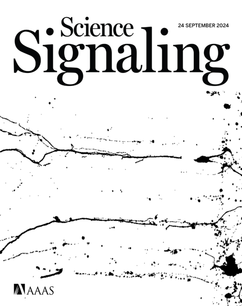
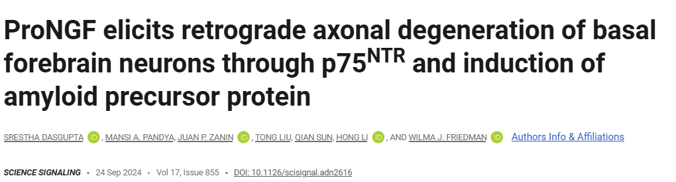
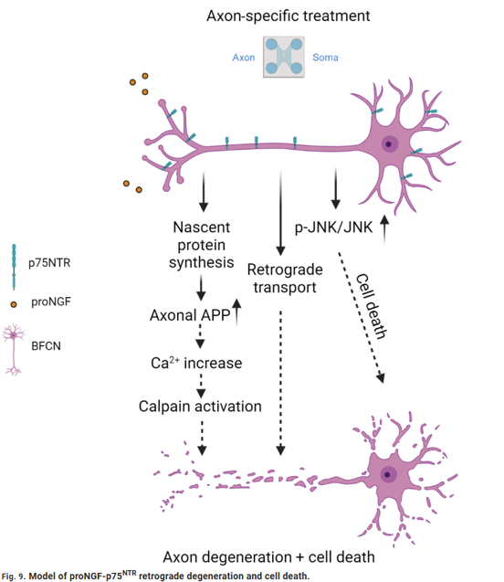
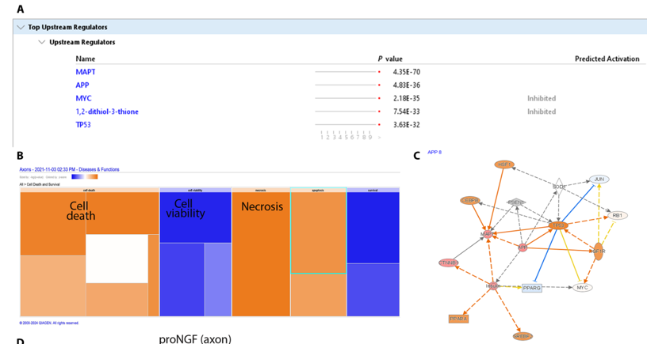
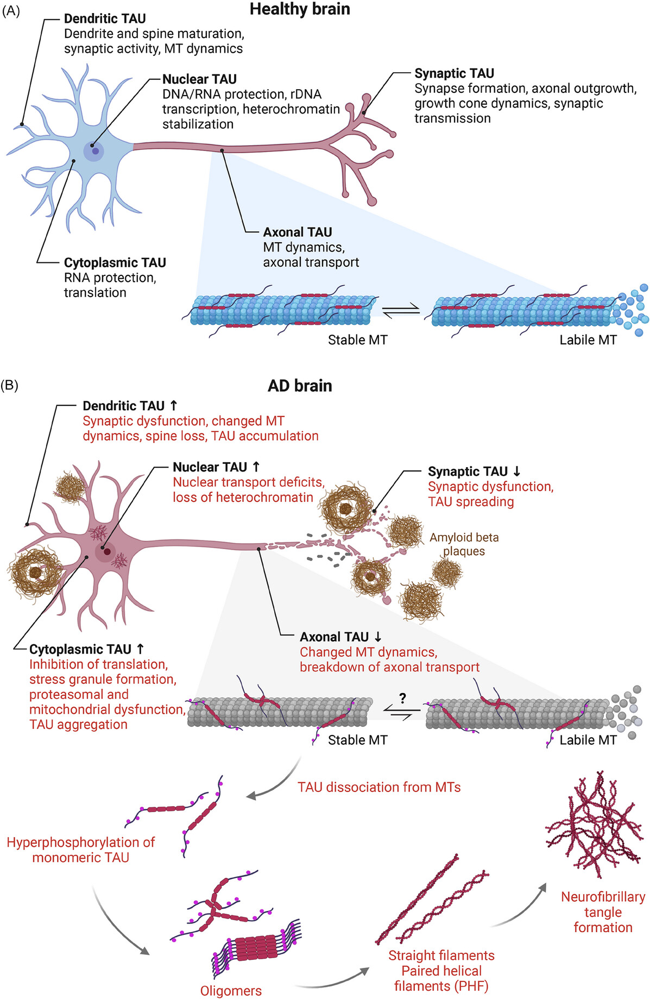
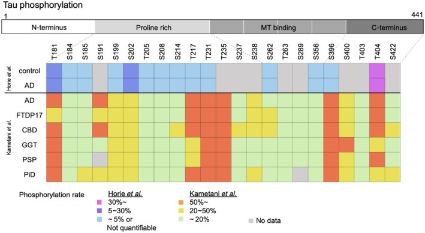

```{r}
#| label: setup
#| include: false
library(magick)
library(tidyverse)
library(ggplot2)
library(patchwork)
library(cowplot)

COL_BLUE <- "#4472C4"
COL_GREY <- "#A6A6A6"
PAL_COMP <- c(Soma = "#4A90D9", Axon = "#E07B54")

theme_wb <- function() {
  theme_classic(base_size = 13) +
    theme(
      axis.text.x        = element_text(angle = 35, hjust = 1, size = 11),
      plot.title         = element_text(face = "bold", size = 13),
      plot.subtitle      = element_text(size = 10, color = "grey45"),
      panel.grid.major.y = element_line(color = "grey90"),
      legend.position    = "none"
    )
}
```

# p75^NTR^ — The Common Thread

## p75^NTR^: A Dual-Role Neurotrophin Receptor

p75^NTR^ (p75 Neurotrophin Receptor) is a member of the **TNF receptor superfamily**
that is central to the survival/death decision of neurons throughout the nervous system.

- Binds **both mature neurotrophins** (NGF, BDNF, NT-3, NT-4) and their **proneurotrophin precursors** (proNGF, proBDNF)
- Mature neurotrophins → survival (via Trk co-receptors)
- **ProNeurotrophins → cell death and degeneration** (via sortilin co-receptor)
- Signalling outcome depends on **ligand form, co-receptor availability, and cellular context**

> p75^NTR^ is the central axis of our lab's research — it appears wherever neurotrophic
> control of cell fate is disrupted.

---

## BFCNs Express p75^NTR^ Throughout Their Lifetime

**Basal forebrain cholinergic neurons (BFCNs)** are among the most p75^NTR^-dependent
neurons in the adult brain.

:::: {.columns}
::: {.column width="55%"}
- Located in the **basal forebrain** (medial septum, diagonal band, nucleus basalis of Meynert)
- Send long cholinergic axons to the **hippocampus and cortex** — essential for learning and memory
- Maintain **high p75^NTR^ expression from development through adulthood**
- Especially vulnerable to withdrawal of trophic support
- **BFCN degeneration is an early and consistent feature of Alzheimer's disease**
:::
::: {.column width="45%"}
{width=100%}
:::
::::

---

## Traumatic Brain Injury Shifts the Neurotrophin Balance

**Traumatic brain injury (TBI)** disrupts the balance between mature and pro-forms
of neurotrophins, with direct consequences for BFCN survival.

- TBI triggers rapid **upregulation of proNGF** in the injured cortex and hippocampus
- ProNGF levels remain elevated for **days to weeks** post-injury
- BFCNs, with their extensive axonal projections, are exposed to elevated proNGF retrogradely
- p75^NTR^/sortilin complex on BFCN axons transduces proNGF → **retrograde death signal**
- This is thought to contribute to the **progressive BFCN loss** seen after TBI and in
  chronic traumatic encephalopathy (CTE)

> TBI → ↑ proNGF → p75^NTR^ activation in BFCN axons → retrograde degeneration → cell death

---

# The SciSignaling Paper

## Published Context

ProNGF — the precursor form of Nerve Growth Factor — was recently shown to drive
**retrograde axonal degeneration** of basal forebrain cholinergic neurons (BFCNs)
through the p75^NTR^ receptor and induction of amyloid precursor protein (APP).

:::: {.columns}
::: {.column width="55%"}
{width=100%}
:::
::: {.column width="45%"}
{width=100%}
:::
::::

---

## The Mechanism

ProNGF acts selectively on axons, triggering a cascade that leads to both
**axon degeneration** and **cell death**:

- Axon-specific proNGF → p75^NTR^ activation
- ↑ Nascent protein synthesis in axons, including **APP**
- APP↑ → Ca²⁺ increase → Calpain activation
- Concurrent retrograde p-JNK/JNK signalling → cell death

{width=55% fig-align="center"}

---

## What Prevents Axon Degeneration vs. Cell Death?

:::: {.columns}
::: {.column width="50%"}
**Prevents Axon Degeneration**

- Blocking **APP** upregulation (siAPP)
- Inhibiting **Calpain** activation
- Blocking **Ca²⁺** influx
- Inhibiting local **protein synthesis** in axons
- Reducing **p75^NTR^** activation at the axon tip
- Preventing **cytoskeletal collapse** (Tau stabilization?)
:::
::: {.column width="50%"}
**Prevents Cell Death**

- Blocking **retrograde JNK/p-JNK** signalling
- Inhibiting **caspase** activation in the soma
- Maintaining **BDNF/TrkB** survival signalling
- Blocking **retrograde transport** of pro-apoptotic signals
- **Somatic Tau** — maintains microtubule integrity for retrograde cargo delivery
:::
::::

> Key insight: axon degeneration and cell death can be **dissociated** —
> they share initiating signals but diverge downstream.

---

## Prior Lab Data — Ingenuity Pathway Analysis (IPA)

To identify which upstream regulators are activated by axonal proNGF treatment,
BFCNs were cultured in **filter chambers** that physically separate axons from
cell bodies.

- Axons were treated with proNGF for **30 minutes**
- Newly synthesised proteins were labelled with **O-propargyl-puromycin (OPP)**
- After a **2-hour labelling window**, axonal lysates were collected and analysed

IPA of the axonal proteome revealed **MAPT (tau)** and **APP** as the top
upstream regulators (*p* = 4.35×10⁻⁷⁰ and 4.83×10⁻³⁶, respectively),
with predicted downstream effects on cell death and necrosis.

{width=75% fig-align="center"}

---

## The Unanswered Question: Tau Upregulation

The IPA data pointed to **tau (MAPT)** as a central upstream regulator — yet
this finding was never followed up in the original study.

- APP was well characterised in the original paper
- **Tau was identified with even stronger statistical significance** than APP
- Tau is known to be locally translated in axons
- Tau levels and phosphorylation state in response to proNGF were **completely unknown**

> This study picks up where the SciSignaling paper left off:
> What happens to **tau** in BFCN axons and soma when proNGF is applied?

---

# Tau: A Multifunctional Protein

## Tau Isoforms & Protein Structure

**Six CNS isoforms** arise from alternative splicing of exons 2, 3, and 10
of the *MAPT* gene, generating 3R and 4R repeat variants that differ in
microtubule-binding affinity.

- **Six brain isoforms** generated by alternative splicing of **MAPT exons 2, 3, and 10** (0N/1N/2N × 3R/4R)
- **Exon 10 inclusion → 4R Tau**, which increases MT-binding affinity vs 3R
- **N-terminal projection domain** — interacts with plasma membrane and other cytoskeletal proteins
- **Proline-rich region** — contains most phosphorylation sites, including AT8 (pSer202/pThr205)
- **Microtubule-binding repeat domain (MTBD)** — core MT binding and aggregation domain
- **C-terminal tail** — regulatory interactions; contains pSer622 site

:::: {.columns}
::: {.column width="50%"}
{width=100%}
:::
::: {.column width="50%"}
{width=100%}
:::
::::

---

## Tau: Beyond its Canonical Role

:::: {.columns}
::: {.column width="45%"}
- **Microtubule stabilization and cytoskeletal coordination:**
  Binds axonal microtubules to maintain cytoskeletal integrity and neuronal polarity.
  Integrates microtubule and actin networks to support axonal structure and dynamics.

- **Regulation of axonal transport:**
  Controls kinesin- and dynein-based trafficking of vesicles, organelles, and signaling complexes.

- **Signaling scaffold:**
  Organizes kinase and stress-response pathways linking extracellular signals to intracellular responses.

- **Synaptic function and plasticity:**
  Participates in synaptic signaling, receptor regulation, and activity-dependent local translation of Tau.

- **Proteostasis and clearance:**
  Interacts with chaperones, proteasome, and autophagy machinery to regulate Tau turnover.

- **Nuclear and stress-related roles:**
  Can localize to the nucleus, where it may contribute to DNA protection and stress responses.
:::
::: {.column width="55%"}
{width=100%}
:::
::::

---

## Tau and Axonal Transport: A Critical Relationship

Tau is not just a passenger in axons — it is an **active regulator** of cargo trafficking.

:::: {.columns}
::: {.column width="50%"}
**Anterograde transport (kinesin)**

- Tau phosphorylation **reduces kinesin attachment** to microtubules
- Hyper-phosphorylated tau → kinesin detachment → impaired delivery of vesicles, APP, synaptic components to axon terminals
- Local tau synthesis in axons may acutely modulate kinesin activity in response to signals
:::
::: {.column width="50%"}
**Retrograde transport (dynein)**

- Tau competes with dynein for microtubule binding
- High tau → reduced dynein processivity → impaired retrograde signalling
- **Survival signals (BDNF/TrkB endosomes)** travel retrogradely — tau excess can block their delivery
- proNGF may induce tau upregulation precisely to impair this retrograde survival signalling
:::
::::

> Tau upregulation in axons could simultaneously **block survival signals** from
> reaching the soma AND **promote cytoskeletal collapse** — a double hit.

---

## Phosphorylation Sites for Antibodies Used

In this research, I quantified tau phosphorylation using three antibodies that report distinct tau states:

- **pThr181 (p-tau181)**: commonly used biomarker-associated phosphorylation site that tracks Alzheimer's disease-related tau pathology in CSF and plasma.
  Key kinases: GSK-3β, CDK5.

- **AT8 (pSer202/pThr205)**: canonical neuropathology epitope used to detect early and established pathological tau (pre-tangles/tangles) in tissue; often treated as a marker of disease-associated tau phosphorylation.
  Key kinases: GSK-3β, MAPK, CDK5.

- **pSer622**: a C-terminal tau site assessed in biochemical studies; typically considered alongside broader phosphorylation patterns.
  Key kinases: Casein kinase 1 and 2, GSK-3β.

---

## Phosphorylation Patterns of Tau

{width=80% fig-align="center"}

---

## Rationale for This Study

The IPA data pointed to **tau (MAPT)** as a central upstream regulator of the
axonal response to proNGF — yet the specific changes in tau protein expression
and phosphorylation state had not been characterised.

**This study asks:**

> Does proNGF treatment alter **total tau** and **phospho-tau** levels
> in the axon and soma compartments of BFCNs?

We used Western blotting with antibodies targeting three phosphorylation sites —
**pThr181**, **pSer202/pThr205 (AT8)**, and **pSer622** — alongside pan-tau,
to capture both the abundance and phosphorylation state of tau across compartments.

---

# Western Blot Results

## September 2025 — ProNGF Time Course

**Conditions:** Ctrl · ProNGF 30 min · ProNGF 45 min · ProNGF 60 min

**Antibody:** Tau & Actin (DyLight 800)

**Compartments:** Soma and Axon

---

## Sep 2025 — Blot Images

```{r}
#| label: sep-blot-images
#| fig-width: 13
#| fig-height: 4.5

panel_a <- ggdraw() +
  draw_image("WB_Sep2025_soma.png") +
  draw_label("A  Soma", x = 0.02, y = 0.97, hjust = 0, vjust = 1,
             fontface = "bold", size = 16)

panel_b <- ggdraw() +
  draw_image("WB_Sep2025_axon.png") +
  draw_label("B  Axon", x = 0.02, y = 0.97, hjust = 0, vjust = 1,
             fontface = "bold", size = 16)

plot_grid(panel_a, panel_b, nrow = 1)
```

---

## Sep 2025 — Tau / Actin Quantification

```{r}
#| label: sep-quant
#| fig-width: 10
#| fig-height: 5

lane_map_sep <- read_csv("ImagesCSV/LaneMapping_ExperimentSep25 - Copy.csv",
                         show_col_types = FALSE)
actin_sep    <- read_csv("ImagesCSV/Sep03_DyLight800_actin.csv",
                         show_col_types = FALSE) |>
  rename(Lane = 1, Actin = Area)
tau_sep      <- read_csv("ImagesCSV/Sep03_DyLight800_tau.csv",
                         show_col_types = FALSE) |>
  rename(Lane = 1, Tau = Area)

df_sep <- lane_map_sep |>
  left_join(tau_sep,   by = "Lane") |>
  left_join(actin_sep, by = "Lane") |>
  mutate(
    Tau_Actin   = Tau / Actin,
    Condition   = factor(Condition,
                         levels = c("Ctrl", "ProNGF 30min",
                                    "ProNGF 45min", "ProNGF 60min")),
    Compartment = factor(Compartment, levels = c("Soma", "Axon"))
  )

ggplot(df_sep, aes(x = Condition, y = Tau_Actin, fill = Compartment)) +
  geom_col(position = position_dodge(width = 0.65), width = 0.6, color = "white") +
  scale_fill_manual(values = PAL_COMP) +
  scale_y_continuous(expand = expansion(mult = c(0, 0.12))) +
  labs(x = NULL, y = "Tau / Actin (a.u.)", fill = "Compartment",
       title = "Sep 2025 — Tau/Actin by Compartment and Condition") +
  theme_wb() +
  theme(legend.position = "right")
```

---

## February 2026 — 1st Western Blot

**Conditions:** Ctrl (soma only) · ProNGF 45/60/75 min · siAPP · siAPP + proNGF

**Channel 680 nm:** panTau (56 kDa) | **Channel 800 nm:** Actin (42 kDa)

*Note: Lane 1 (Ctrl) excluded from axon analysis.*

---

## Feb 2026 (1st WB) — Blot Images

```{r}
#| label: feb1-blot-images
#| fig-width: 13
#| fig-height: 4.5

panel_a <- ggdraw() +
  draw_image("figs/ColoredLabeledWB_Feb12.png") +
  draw_label("A  Composite", x = 0.02, y = 0.97, hjust = 0, vjust = 1,
             fontface = "bold", size = 16)

panel_b <- ggdraw() +
  draw_image("figs/ELINA_2026-02-05_12h18m48s_IRDye_800CW_.jpg") +
  draw_label("B  800CW (Actin)", x = 0.02, y = 0.97, hjust = 0, vjust = 1,
             fontface = "bold", size = 16)

panel_c <- ggdraw() +
  draw_image("figs/ELINA_2026-02-06_13h04m41s_IRDye_680RD_.jpg") +
  draw_label("C  680RD (Tau)", x = 0.02, y = 0.97, hjust = 0, vjust = 1,
             fontface = "bold", size = 16)

plot_grid(panel_a, panel_b, panel_c, nrow = 1)
```

---

## Feb 2026 (1st WB) — panTau / Actin

```{r}
#| label: feb1-quant
#| fig-width: 13
#| fig-height: 5

axon_conditions <- c("ProNGF 45min", "ProNGF 60min", "ProNGF 75min",
                     "siAPP", "siAPP + proNGF")
soma_conditions <- c("Ctrl", "ProNGF 45min", "ProNGF 60min",
                     "ProNGF 75min", "siAPP", "siAPP + proNGF")

raw_680_ax <- read_csv("ImagesCSV/Feb05_IRDye_680_panTau_quantification_only_axons.csv",
                       show_col_types = FALSE) |>
  rename(lane = 1, area = Area) |>
  mutate(Condition = factor(axon_conditions, levels = axon_conditions))

raw_800_ax <- read_csv("ImagesCSV/Feb05_IRDye_800_Ms_Act_quantification_only_axons.csv",
                       show_col_types = FALSE) |>
  rename(lane = 1, area = Area) |>
  mutate(Condition = factor(axon_conditions, levels = axon_conditions))

raw_680_sm <- read_csv("ImagesCSV/Feb05_IRDye_680_panTau_quantification_only_soma.csv",
                       show_col_types = FALSE) |>
  rename(lane = 1, area = Area) |>
  mutate(Condition = factor(soma_conditions, levels = soma_conditions))

raw_800_sm <- read_csv("ImagesCSV/Feb05_IRDye_800_Ms_Act_quantification_only_soma.csv",
                       show_col_types = FALSE) |>
  rename(lane = 1, area = Area) |>
  mutate(Condition = factor(soma_conditions, levels = soma_conditions))

axon_ratio <- inner_join(
  raw_680_ax |> select(lane, Condition, tau = area),
  raw_800_ax |> select(lane, actin = area),
  by = "lane"
) |> mutate(ratio = tau / actin)

soma_ratio_wb1 <- inner_join(
  raw_680_sm |> select(lane, Condition, tau = area),
  raw_800_sm |> select(lane, actin = area),
  by = "lane"
) |> mutate(ratio = tau / actin)

panel_b <- ggdraw() +
  draw_plot(
    ggplot(axon_ratio, aes(x = Condition, y = ratio)) +
      geom_col(fill = PAL_COMP["Axon"], colour = "black", width = 0.65) +
      labs(x = NULL, y = "panTau / Actin (a.u.)", title = "Axon") +
      theme_wb()
  ) +
  draw_label("B", x = 0.02, y = 0.97, hjust = 0, vjust = 1,
             fontface = "bold", size = 16)

panel_c <- ggdraw() +
  draw_plot(
    ggplot(soma_ratio_wb1, aes(x = Condition, y = ratio)) +
      geom_col(fill = PAL_COMP["Soma"], colour = "black", width = 0.65) +
      labs(x = NULL, y = "panTau / Actin (a.u.)", title = "Soma") +
      theme_wb()
  ) +
  draw_label("C", x = 0.02, y = 0.97, hjust = 0, vjust = 1,
             fontface = "bold", size = 16)

panel_a <- ggdraw() +
  draw_image("WB_Feb2026_1stWB.png") +
  draw_label("A", x = 0.02, y = 0.97, hjust = 0, vjust = 1,
             fontface = "bold", size = 16)

plot_grid(panel_a, panel_b, panel_c, nrow = 1, rel_widths = c(1.2, 1, 1))
```

---

## February 2026 — 2nd Western Blot (Soma)

**Conditions:** Soma compartment only

**Channel 680 nm:** pTau65 + pTau56 | **Channel 800 nm:** pTau56 + Actin

---

## Feb 2026 (2nd WB) — Blot Images

```{r}
#| label: feb2-blot-images
#| fig-width: 13
#| fig-height: 4.5

panel_a <- ggdraw() +
  draw_image("figs/ColoredLabeledWB_onlySoma.png") +
  draw_label("A  Composite", x = 0.02, y = 0.97, hjust = 0, vjust = 1,
             fontface = "bold", size = 16)

panel_b <- ggdraw() +
  draw_image("figs/ELINA_2026-02-11_13h52m00s_IRDye_680RD_.jpg") +
  draw_label("B  680RD (pSer622)", x = 0.02, y = 0.97, hjust = 0, vjust = 1,
             fontface = "bold", size = 16)

panel_c <- ggdraw() +
  draw_image("figs/ELINA_2026-02-13_10h47m12s_Composite_.jpg") +
  draw_label("C  pSer622 + Pan-Tau", x = 0.02, y = 0.97, hjust = 0, vjust = 1,
             fontface = "bold", size = 16)

plot_grid(panel_a, panel_b, panel_c, nrow = 1)
```

---

## Feb 2026 (2nd WB) — pTau Expression in Soma

```{r}
#| label: feb2-quant
#| fig-width: 13
#| fig-height: 5

lane_map_2 <- read_csv("ImagesCSV/LaneMapping_ExperimentJan26_2ndWB.csv",
                       show_col_types = FALSE) |>
  mutate(Lane = as.integer(Lane),
         Condition = factor(Condition, levels = unique(Condition)))
condition_levels_2 <- levels(lane_map_2$Condition)

band_map_2     <- read_csv("ImagesCSV/BandMapping_ExperimentJan26_2ndWB - Copy.csv",
                           show_col_types = FALSE)
band_map_680_2 <- band_map_2 |> filter(Channel == 680)
band_map_800_2 <- band_map_2 |> filter(Channel == 800)

data_680_2 <- read_csv(
  "ImagesCSV/Feb26_IRDye_680RD_Ms_panTau_actin_quantification.csv",
  show_col_types = FALSE) |>
  rename(area = Area) |>
  left_join(band_map_680_2, by = c("band" = "Band")) |>
  left_join(lane_map_2,    by = c("lane" = "Lane")) |>
  mutate(Condition = factor(Condition, levels = condition_levels_2))

data_800_2 <- read_csv(
  "ImagesCSV/Feb26_IRDye_800_Rb_pTau_p622_p202_quantification.csv",
  show_col_types = FALSE) |>
  rename(area = Area) |>
  left_join(band_map_800_2, by = c("band" = "Band")) |>
  left_join(lane_map_2,    by = c("lane" = "Lane")) |>
  mutate(Condition = factor(Condition, levels = condition_levels_2))

wide_800_2 <- data_800_2 |>
  select(lane, Condition, Protein, area) |>
  pivot_wider(names_from = Protein, values_from = area) |>
  mutate(Tau_Actin = pTau56 / Actin)

tau_sum_2 <- data_680_2 |>
  group_by(lane, Condition) |>
  summarise(tau_total = sum(area, na.rm = TRUE), .groups = "drop")

actin_800_2 <- data_800_2 |>
  filter(Protein == "Actin") |>
  select(lane, actin = area)

ratio_sum_2 <- tau_sum_2 |>
  left_join(actin_800_2, by = "lane") |>
  mutate(ratio = tau_total / actin,
         Condition = factor(Condition, levels = condition_levels_2))

panel_a <- ggdraw() +
  draw_image("WB_Feb2026_2ndWB.png") +
  draw_label("A", x = 0.02, y = 0.97, hjust = 0, vjust = 1,
             fontface = "bold", size = 16)

panel_b <- ggdraw() +
  draw_plot(
    ggplot(wide_800_2, aes(x = Condition, y = Tau_Actin)) +
      geom_col(fill = PAL_COMP["Soma"], colour = "black", width = 0.65) +
      labs(x = NULL, y = "pTau56 / Actin (a.u.)", title = "pTau56 / Actin (800 nm)") +
      theme_wb()
  ) +
  draw_label("B", x = 0.02, y = 0.97, hjust = 0, vjust = 1,
             fontface = "bold", size = 16)

panel_c <- ggdraw() +
  draw_plot(
    ggplot(ratio_sum_2, aes(x = Condition, y = ratio)) +
      geom_col(fill = PAL_COMP["Soma"], colour = "black", width = 0.65) +
      labs(x = NULL, y = "Total Tau / Actin (a.u.)",
           title = "Total Tau / Actin (680 nm)",
           subtitle = "(pTau65 + pTau56) / Actin") +
      theme_wb()
  ) +
  draw_label("C", x = 0.02, y = 0.97, hjust = 0, vjust = 1,
             fontface = "bold", size = 16)

plot_grid(panel_a, panel_b, panel_c, nrow = 1, rel_widths = c(1.2, 1, 1))
```

---

## Cross-Experiment — Soma Tau/Actin Ratio

```{r}
#| label: cross-ratio
#| fig-width: 8
#| fig-height: 5

ratio_wb1 <- soma_ratio_wb1 |>
  select(Condition, ratio) |> mutate(WB = "1st WB — panTau/Actin")

ratio_wb2_sum <- ratio_sum_2 |>
  select(Condition, ratio) |>
  mutate(WB = "2nd WB — Total Tau/Actin (680nm)",
         Condition = factor(as.character(Condition), levels = soma_conditions))

ratio_wb2_pt <- wide_800_2 |>
  select(Condition, ratio = Tau_Actin) |>
  mutate(WB = "2nd WB — pTau56/Actin (800nm)",
         Condition = factor(as.character(Condition), levels = soma_conditions))

ratio_both <- bind_rows(ratio_wb1, ratio_wb2_sum, ratio_wb2_pt) |>
  mutate(Condition = factor(as.character(Condition), levels = soma_conditions),
         WB = factor(WB, levels = c("1st WB — panTau/Actin",
                                    "2nd WB — Total Tau/Actin (680nm)",
                                    "2nd WB — pTau56/Actin (800nm)")))

ggplot(ratio_both, aes(x = Condition, y = ratio, fill = WB)) +
  geom_col(position = position_dodge(width = 0.8), colour = "black", width = 0.65) +
  scale_fill_manual(values = c("1st WB — panTau/Actin"            = "#7EB3E8",
                               "2nd WB — Total Tau/Actin (680nm)" = COL_BLUE,
                               "2nd WB — pTau56/Actin (800nm)"    = COL_GREY)) +
  labs(title = "Soma Tau/Actin Ratio — 1st vs 2nd WB",
       x = NULL, y = "Tau / Actin (a.u.)", fill = NULL) +
  theme_classic(base_size = 12) +
  theme(axis.text.x     = element_text(angle = 35, hjust = 1),
        legend.position = "top",
        legend.text     = element_text(size = 9))
```

---

# Immunofluorescence Results

## Antibody Optimization: TrkB & Tau

We tested whether TrkB (the BDNF receptor) and Tau co-localize in BFCN axons.

```{r}
#| label: if-trkb-tau
#| fig-width: 10
#| fig-height: 7
#| fig-align: center
#| out-width: "90%"

knitr::include_graphics("figures/precomputed/fig-trkb-tau.png")
```

---

## Tau Distribution Along Axons

Tau signal is distributed along axonal shafts with enrichment at specific regions.

```{r}
#| label: if-tau-distribution
#| fig-width: 6
#| fig-height: 12
#| fig-align: center
#| out-width: "70%"

knitr::include_graphics("figures/precomputed/fig-tau-distribution.png")
```

---

## p75 / Tau / Tuj1 Triple Staining — Optimizing Sequential Protocol

August 2025: testing the staining order with p75, Tau (red), and Tuj1 (far red) simultaneously.

```{r}
#| label: if-tuj1-tau-swapped
#| fig-width: 12
#| fig-height: 8
#| fig-align: center
#| out-width: "95%"

knitr::include_graphics("figures/precomputed/fig-tuj1-tau-swapped.png")
```

---

## p75 / Tau / Tuj1 — July 2025 Experiment

```{r}
#| label: if-p75-tuj1-tau
#| fig-width: 12
#| fig-height: 8
#| fig-align: center
#| out-width: "95%"

knitr::include_graphics("figures/precomputed/fig-p75-tuj1-tau.png")
```

---

## p75 / Tau / Tuj1 — Ctrl, BDNF, and BDNF+ProNGF

```{r}
#| label: if-combined
#| fig-width: 14
#| fig-height: 10
#| fig-align: center
#| out-width: "100%"

knitr::include_graphics("figures/precomputed/fig-if-combined.png")
```

---

## Confocal Imaging — Tau in Axonal Compartments

```{r}
#| label: if-confocal
#| fig-width: 10
#| fig-height: 7
#| fig-align: center
#| out-width: "90%"

knitr::include_graphics("figs/Confocal_Images.png")
```

---

# Summary

## Key Findings

- IPA of axonal lysates after proNGF treatment identified **MAPT (tau)** and **APP**
  as the top upstream regulators, motivating a direct biochemical assessment of tau
- ProNGF treatment induces changes in **total Tau** levels detectable by Western blot across
  **Sep 2025** (time course) and **Feb 2026** (treatment + siAPP) experiments
- Phosphorylation at **pSer202/pThr205** and **pSer622** sites assessed across compartments
- Soma-only repeat blots confirm signal specificity in the **cell body fraction**
- Tau/Actin ratios consistent across two independent Feb 2026 blots
- Immunofluorescence confirms **tau presence in BFCN axons**, with changes in
  distribution and intensity under different treatment conditions

**Next steps:** Statistical testing across biological replicates; confocal quantification

---

## Working Model

```{r}
#| label: working-model-mechanism
#| fig-width: 10
#| fig-height: 6
#| fig-align: center
#| out-width: "90%"


```

> Axonal proNGF → p75^NTR^ → ↑ local Tau translation →
> altered microtubule dynamics → impaired retrograde survival signalling →
> BFCN cell death
