```{r setup, include=FALSE}
knitr::opts_chunk$set(echo = FALSE, warning = FALSE, message = FALSE)
```

# Background

## Published Context

ProNGF — the precursor form of Nerve Growth Factor — was recently shown to drive
**retrograde axonal degeneration** of basal forebrain cholinergic neurons (BFCNs)
through the p75^NTR^ receptor and induction of amyloid precursor protein (APP).

:::::: {.columns}
::: {.column width="55%"}
```{r fig-paper-header, out.width="100%"}
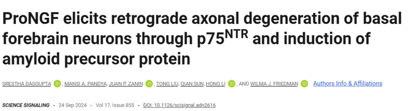
```
:::
::: {.column width="45%"}
```{r fig-journal-cover, out.width="100%"}
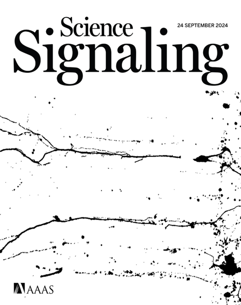
```
:::
::::::


## Tau isoforms in the adult human brain

```{r tau-isoforms-fig, out.width="95%"}
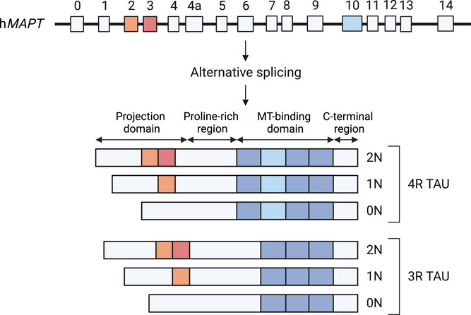
Tau_Structure_scidirect.jpg
```

- **Six brain isoforms** are generated by alternative splicing of **MAPT exons 2, 3, and 10** (0N/1N/2N × 3R/4R).
- **Exon 10 inclusion → 4R Tau**, which increases MT-binding affinity vs 3R.

---

## Additional roles of Tau beyond microtubule binding

```{r tau-roles-fig, out.width="95%"}
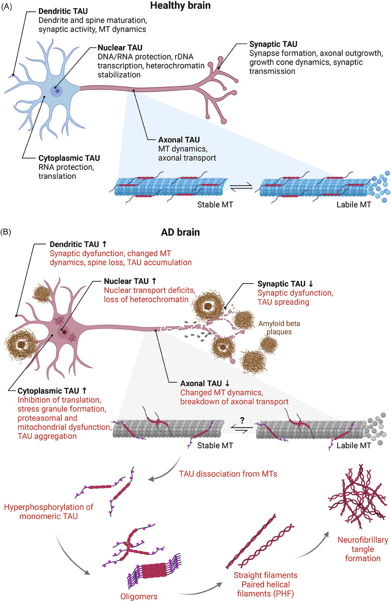
```

- Tau biology is **compartment-specific** (axon, dendrite, synapse, nucleus) and shifts in AD with **somatodendritic missorting**, impaired transport, and aggregation.
- Use this to motivate why **Tau can act as an upstream regulator** of multiple axonal stress/degeneration pathways.


---

## The Mechanism

ProNGF acts selectively on axons, triggering a cascade that leads to both
**axon degeneration** and **cell death**:

- Axon-specific proNGF → p75^NTR^ activation
- ↑ Nascent protein synthesis in axons, including **APP**
- APP↑ → Ca²⁺ increase → Calpain activation
- Concurrent retrograde p-JNK/JNK signalling → cell death

```{r fig-mechanism, out.width="55%", fig.align="center"}
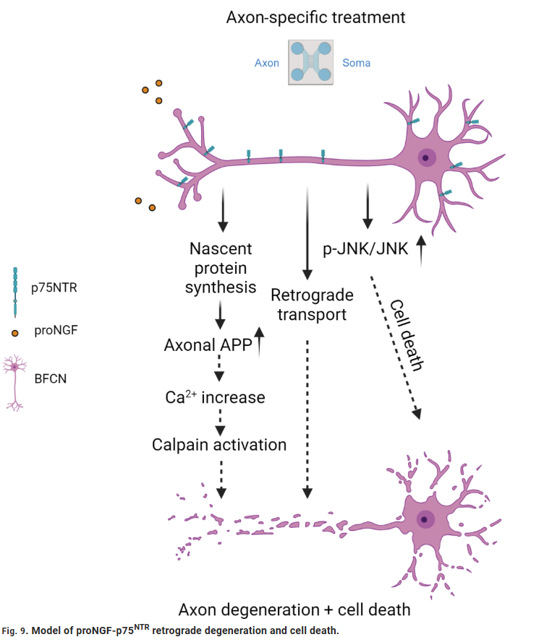
```

---

## Prior Lab Data — Ingenuity Pathway Analysis (IPA)

To identify which upstream regulators are activated by axonal proNGF treatment,
BFCNs were cultured in **filter chambers** that physically separate axons from
cell bodies.

- Axons were treated with proNGF for **30 minutes**
- Newly synthesised proteins were labelled with **O-propargyl-puromycin (OPP)**
- After a **2-hour labelling window**, axonal lysates were collected and analysed

IPA of the axonal proteome revealed **MAPT (tau)** and **APP** as the top
upstream regulators (*p* = 4.35×10⁻⁷⁰ and 4.83×10⁻³⁶, respectively),
with predicted downstream effects on cell death and necrosis.

```{r fig-ipa, out.width="75%", fig.align="center"}
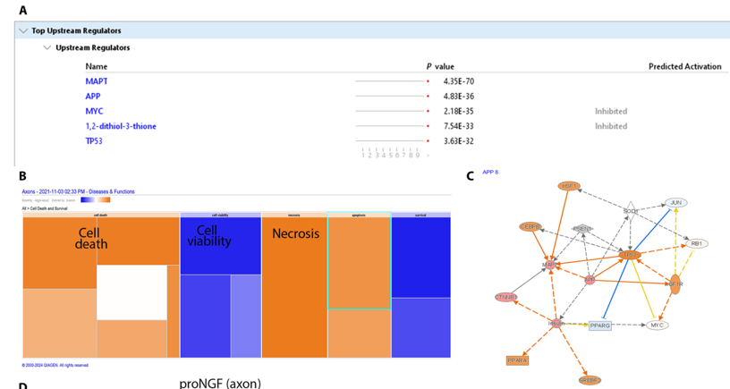
```

---

## Rationale for This Study

The IPA data pointed to **tau (MAPT)** as a central upstream regulator of the
axonal response to proNGF — yet the specific changes in tau protein expression
and phosphorylation state had not been characterised.

**This study asks:**

> Does proNGF treatment alter **total tau** and **phospho-tau** levels
> in the axon and soma compartments of BFCNs?

We used Western blotting with antibodies targeting three phosphorylation sites —
**pThr181**, **pSer202/pThr205 (AT8)**, and **pSer622** — alongside pan-tau,
to capture both the abundance and phosphorylation state of tau across
compartments.

# Total Tau Increase in Response to ProNGF Treatment

## Overview

ProNGF treatment was applied to compartmentalized basal forebrain cholinergic neuron cultures.

Western blotting was used to assess changes in **total Tau** and **phospho-Tau** protein levels across soma and axon compartments.

---

## Tau Phosphorylation Sites for Antibodies used

::: {style="font-size: 14pt;"}

In this research, I quantified tau phosphorylation using three antibodies that report distinct tau states:

- **pThr181 (p-tau181)**: commonly used biomarker-associated phosphorylation site that tracks Alzheimer's disease-related tau pathology in CSF and plasma and is widely used for staging/stratification.  
  (Context review: https://pmc.ncbi.nlm.nih.gov/articles/PMC10839341/)
Key kinases: GSK-3β, CDK5.

- **AT8 (pSer202/pThr205)**: canonical neuropathology epitope used to detect early and established pathological tau (pre-tangles/tangles) in tissue; often treated as a marker of disease-associated tau phosphorylation.  
  (Epitope/usage context: https://www.alzforum.org/alzantibodies/tau-at8-phospho-tau-ser-202-thr-205)
Key kinases: GSK-3β, MAPK, CDK5.

- **pSer622**: a C-terminal tau site sometimes assessed in biochemical studies; interpretation can depend on antibody specificity and isoform context, and is typically considered alongside broader phosphorylation patterns rather than as a standalone "core biomarker" site.  
  (Phosphorylation landscape context: https://pmc.ncbi.nlm.nih.gov/articles/PMC10839341/)
Key kinases: Casein kinase 1 and 2, GSK-3β.  
  
:::  

---

## Phosphorylation Patterns of Tau

```{r fig-phospho-patterns, fig.cap="The figure shows the phosphorylation sites of tau identified in each disease and the frequency (Horie et al. and Kametani et al.)", out.width="80%"}
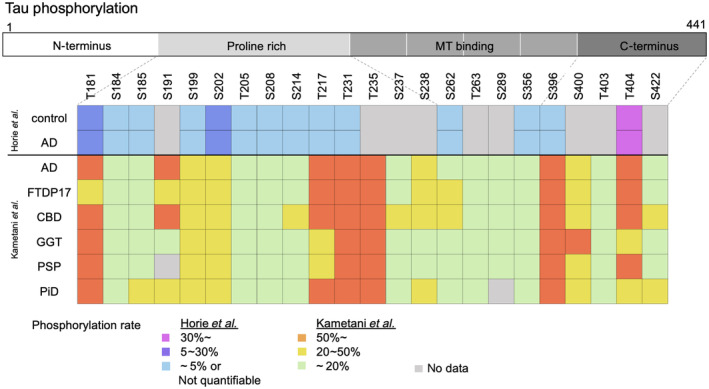
```

---

## Composite Western Blot — All Compartments

```{r fig-composite-wb, fig.cap="Western blot analysis of Tau and actin expression. Composite image.", out.width="80%"}
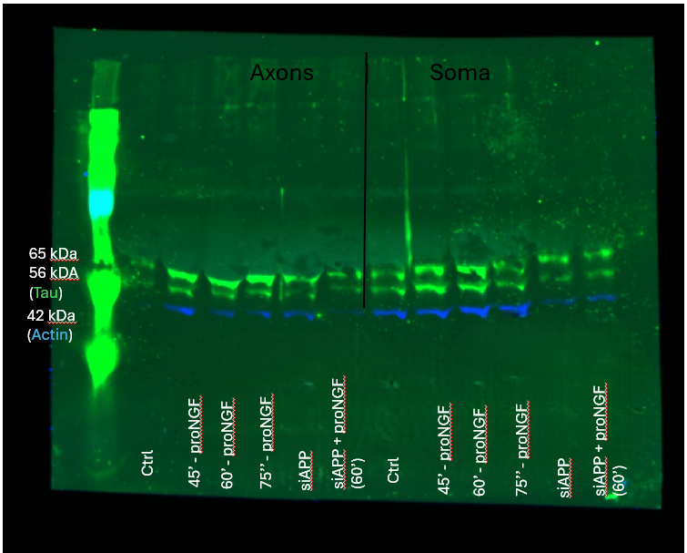
```

---

## Representative Composite Image

```{r fig-actin-tau, fig.cap="Representative composite image showing actin (blue) and Tau (green).", out.width="80%"}
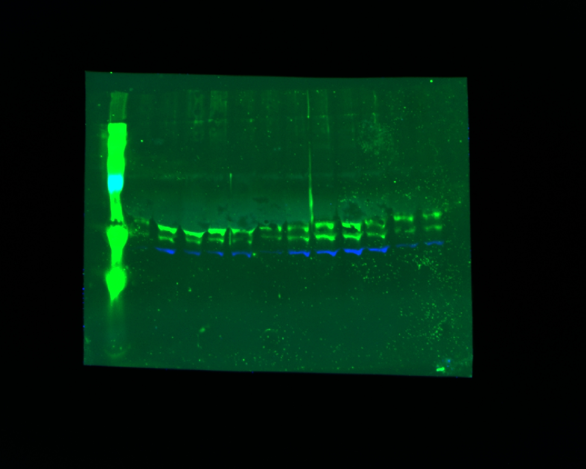
```

---

## Green Channel — Actin & Phospho-Tau (800CW)

```{r fig-actin-ptau-800, fig.cap="Green channel image showing actin (mouse) and phospho-Tau (rabbit; pSer202/pThr205).", out.width="80%"}
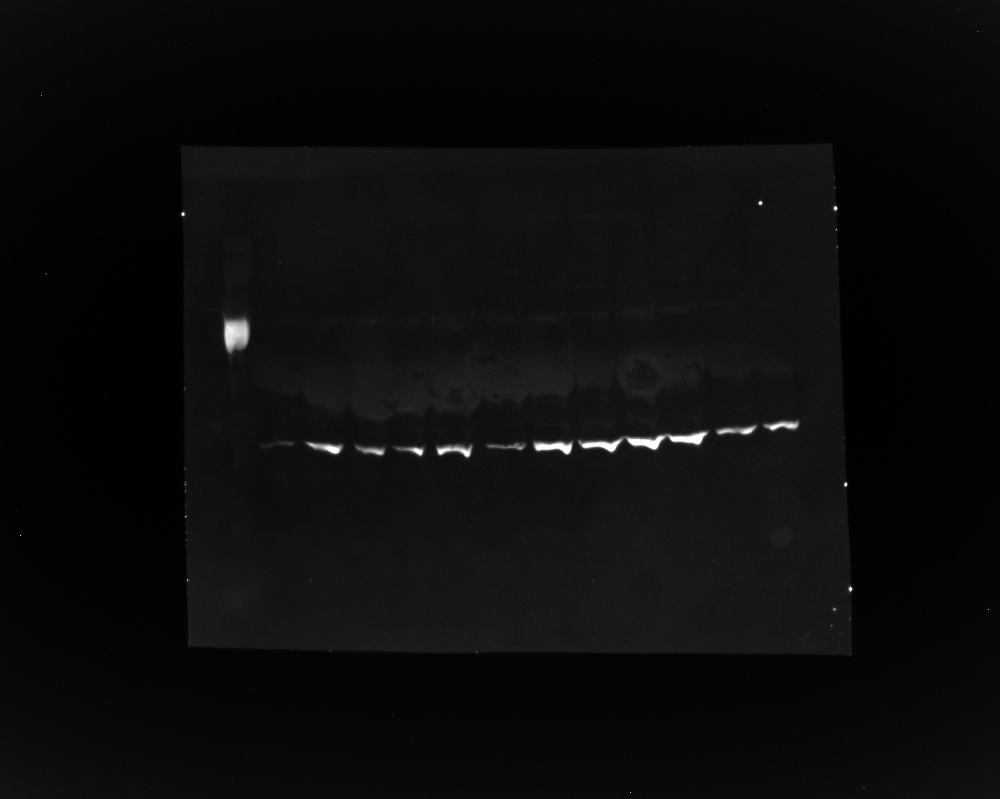
```

---

## Red Channel — Total Tau (pan-Tau; Rb-237)

```{r fig-tau-680, fig.cap="Red channel image showing total Tau (pan-Tau; Rb-237).", out.width="80%"}
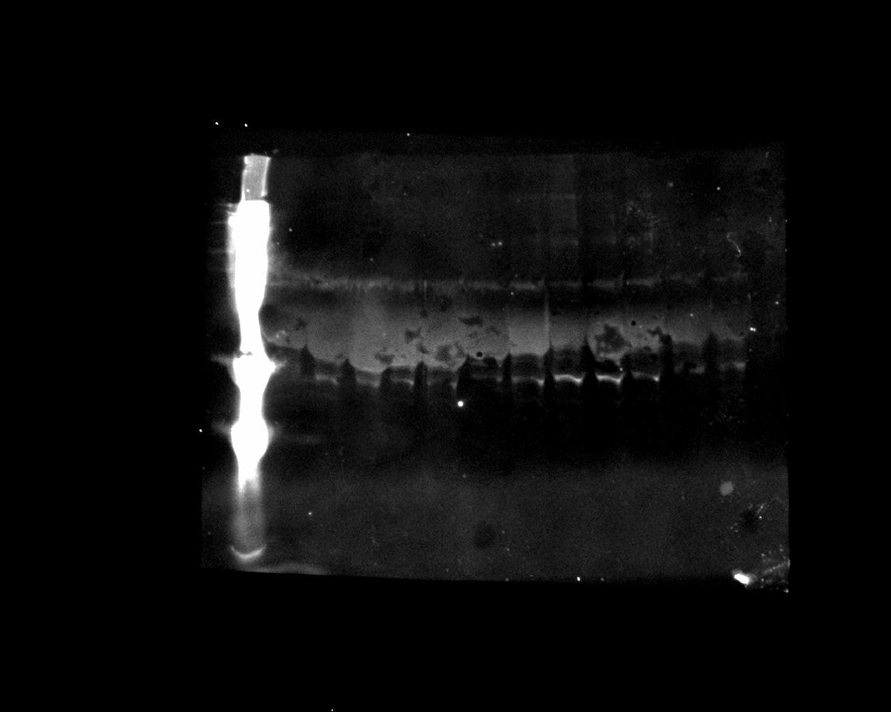
```

# Soma-Only Repeat Western Blot

## Overview

A repeat Western blot was performed on **soma-only** fractions from the same samples as above.

Targets: **phospho-Tau (pSer622)**, **pan-Tau**, and **actin**.

---

## Soma-Only Composite Western Blot

```{r fig-soma-wb, fig.cap="Western blot analysis of phosphoTau, panTau and actin expression. Composite image.", out.width="80%"}
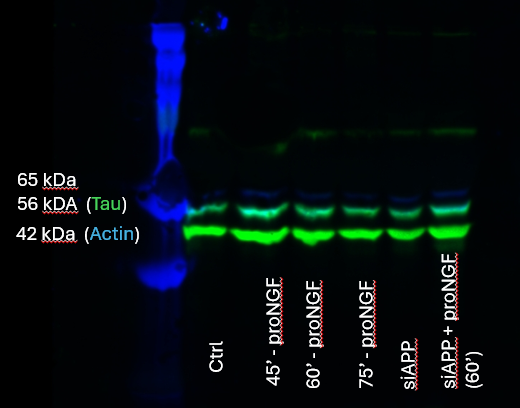
```

---

## Red Channel — Phospho-Tau at Ser622 (680RD)

```{r fig-ptau-ser622, fig.cap="Red channel image showing phospho-Tau at Ser622 (pSer622).", out.width="80%"}
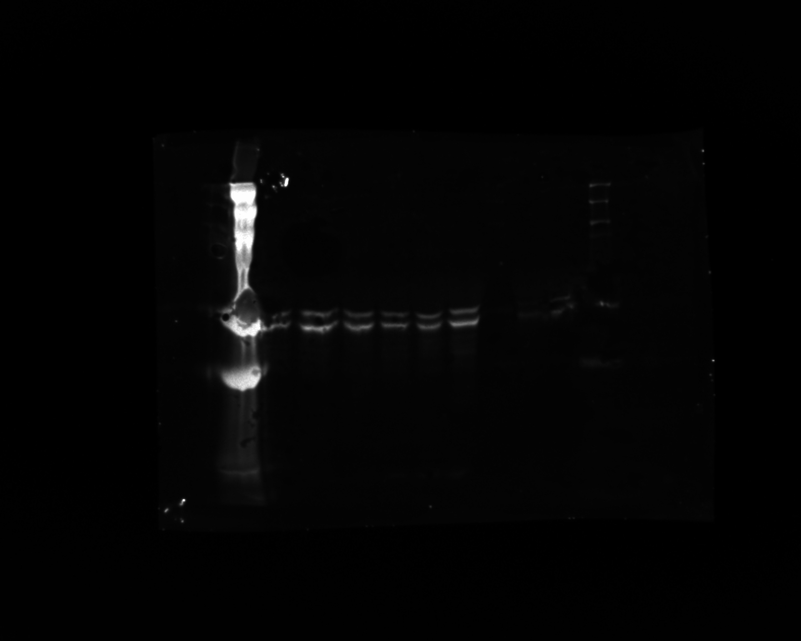
```

---

## Composite — pSer622 & Pan-Tau

```{r fig-ptau-composite, fig.cap="Composite image: phospho-Tau at Ser622 (red channel) and pan-Tau (green channel; Red antibody = Rabbit, Green antibody = Mouse).", out.width="80%"}
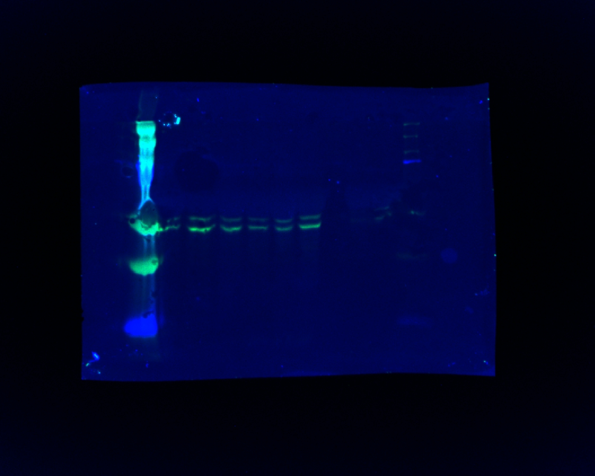
```

# Summary

## Key Findings

- IPA of axonal lysates after proNGF treatment identified **MAPT (tau)** and **APP**
  as the top upstream regulators, motivating a direct biochemical assessment of tau
- ProNGF treatment induces changes in **total Tau** levels detectable by Western blot
- Phosphorylation at **pSer202/pThr205** and **pSer622** sites assessed across compartments
- Soma-only repeat blots confirm signal specificity in the **cell body fraction**

**Next steps:** Quantification of band intensities and normalization to actin loading control
